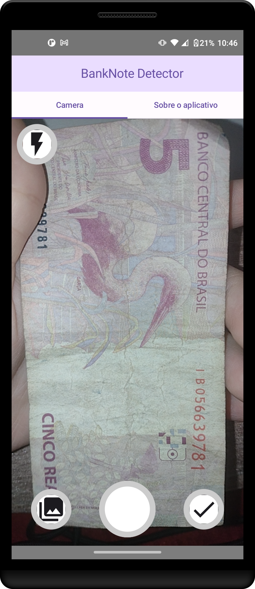
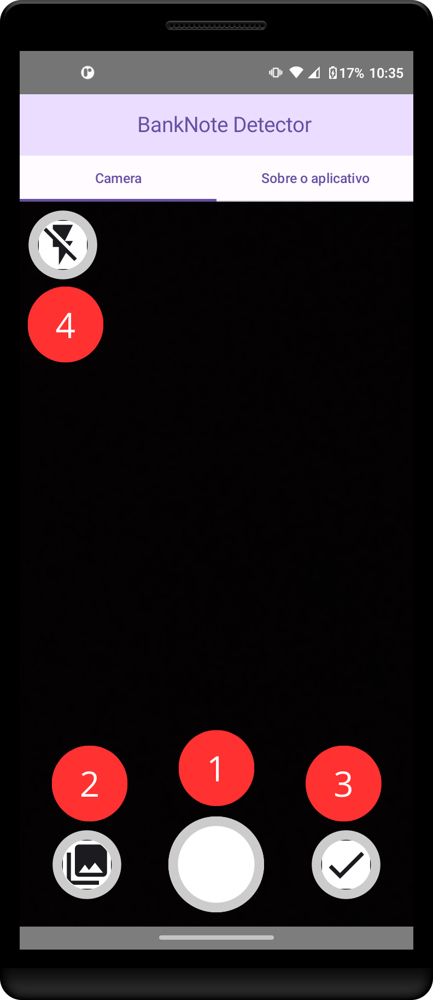
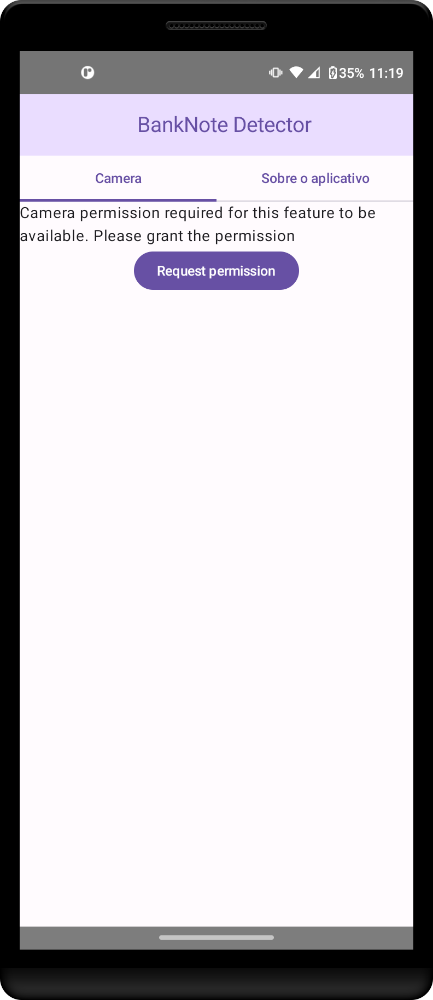
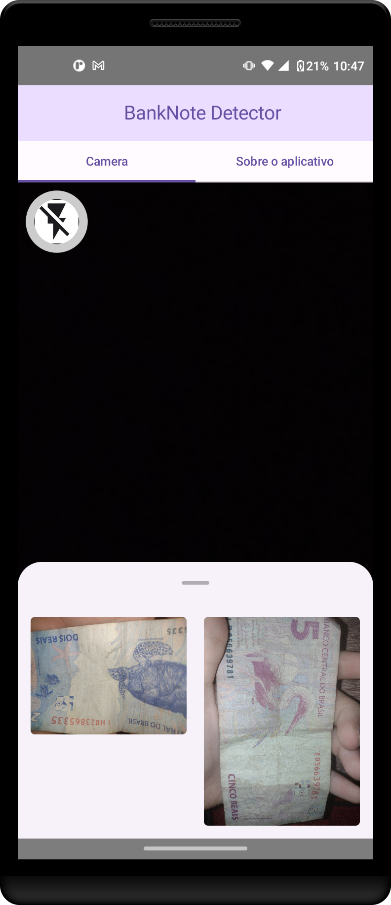
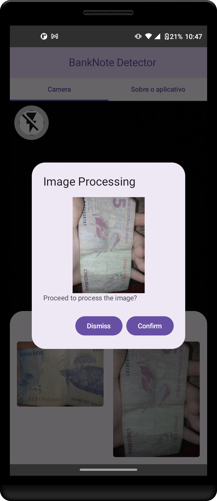
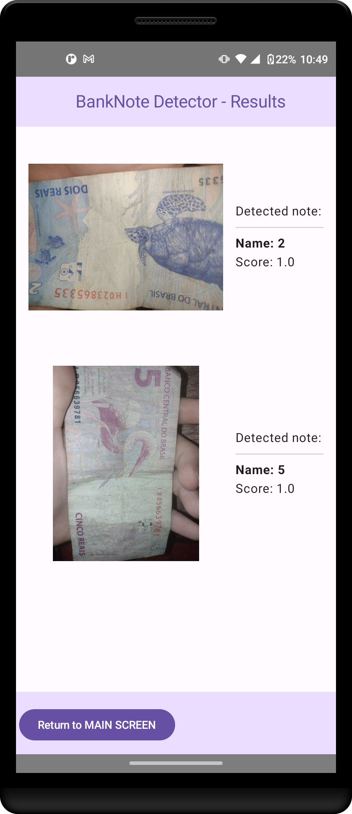

# Detector de Cédulas para Android



## Visão Geral

Este projeto Android tem como objetivo fornecer uma solução conveniente para detectar e classificar as cédulas brasileiras usando a câmera do dispositivo. A aplicação é projetada para identificar e categorizar notas com valores de 2, 5, 10, 20, 50 e 100 reais brasileiros.

A imagem a baixo mostra os features do aplicativo:



## Recursos

- **Integração de Câmera:** Utiliza a câmera do dispositivo para capturar imagens de cédulas.

- **Classificação:** Emprega um algoritmo de classificação para determinar a denominação da cédula detectada.

- **Denominações Suportadas:** Reconhece cédulas brasileiras com valores de 2, 5, 10, 20, 50 e 100 reais.

## Como Começar

Siga estes passos para começar com o projeto Detector de Cédulas:

1. **Clonar o Repositório:**
   ```bash
   git clone https://github.com/seu-nome-de-usuario/detector-cedulas-android.git
   ```
2. Abrir no Android Studio:
    - **Inicie o Android Studio e abra o projeto clonado.**

3. Construir e Executar:
    - **Construa o projeto e execute-o em um dispositivo Android ou emulador.**
Alternativamente, utilize o instalável .apk para utilizar em um dispositivo móvel. (Recomenda-se o uso de Android 12+)


## Uso

1. Inicio do Aplicativo:
    - Abra o aplicativo Detector de Cédulas em seu dispositivo Android e conceda as permissões necessárias para a completa utilização.

   


2. Captura de Imagem:
    - Utilize a função de câmera para capturar uma imagem de uma cédula brasileira.


3. Visualização do Resultado:
   - Utilize o símbolo (2) marcado na imagem, selecione a imagem a ser analisada e prossiga para realizar a classificação.
   - Utilize a função (3) para se direcionar para a tela de resultados.

## Exemplo de Uso

1. Captura de Imagem
   


2. Visualização da imagem 



3. Processamento da imagem



4.  Resultados




## Contribuições
  O projeto foi possível devido a investimentos da FAEPI, Motorola e ao Projeto Impact-LAB do Instituto de Computação (ICOMP) da Universidade Federal do Amazonas (UFAM).
  
  Agradecemos a futuras contribuições para aprimorar a funcionalidade e o desempenho do projeto Detector de Cédulas. 
  Siga as diretrizes descritas no arquivo CONTRIBUTING.md.
  
## Licença

Este projeto está licenciado sob a Licença MIT.

